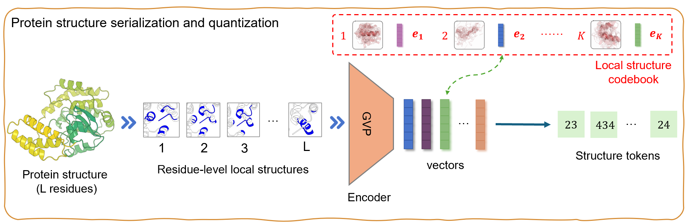

# Venus-ProSST
Code for _ProSST: A Pre-trained Protein Sequence and Structure Transformer with Disentangled Attention._ (NeurIPS 2024)

## News
- Our MSA-Enhanced model [VenusREM](https://github.com/ai4protein/VenusREM) has achieved 0.518 Spearman's rho in the ProteinGym benchmark.

## 1 Install

```shell
git clone https://github.com/ai4protein/ProSST.git
cd ProSST
pip install -r requirements.txt
export PYTHONPATH=$PYTHONPATH:$(pwd)
```

## 2 Structure quantizer



[ProSST Structure Quantizer](zero_shot/sst_token.ipynb)
```python
from prosst.structure.get_sst_seq import SSTPredictor
predictor = SSTPredictor(structure_vocab_size=2048) # can be 20, 128, 512, 1024, 2048, 4096
result = predictor.predict_from_pdb('example_data/p1.pdb')
```

Output:
```
[407, 998, 1841, 1421, 653, 450, 117, 822, ...]
```


## 3 ProSST models have been uploaded to huggingface 🤗 Transformers
```python
from transformers import AutoModelForMaskedLM, AutoTokenizer
model = AutoModelForMaskedLM.from_pretrained("AI4Protein/ProSST-2048", trust_remote_code=True)
tokenizer = AutoTokenizer.from_pretrained("AI4Protein/ProSST-2048", trust_remote_code=True)
```

See [AI4Protein/ProSST-*](https://huggingface.co/AI4Protein?search_models=ProSST) for more models.

## 4 Zero-shot mutant effect prediction

### 4.1 Example notebook
[Zero-shot mutant effect prediction](zero_shot/score_mutant.ipynb)

### 4.2 Run ProteinGYM Benchmark
Download dataset from [Google Driver](https://drive.google.com/file/d/1lSckfPlx7FhzK1FX7EtmmXUOrdiMRerY/view?usp=sharing).
(This file contains quantized structures within ProteinGYM).

Original PDB dataset is the same as [ProtSSN](https://github.com/ai4protein/ProtSSN), which can be downloaded from [Huggingface](https://huggingface.co/datasets/tyang816/ProteinGym_v1/resolve/main/ProteinGym_v1_AlphaFold2_PDB.zip).

```shell
cd example_data
unzip proteingym_benchmark.zip
```

```shell
python zero_shot/proteingym_benchmark.py --model_path AI4Protein/ProSST-2048 \
--structure_dir example_data/structure_sequence/2048
```
<!-- 
## 5 Representation
```

```

## 6 Transfer-Learning
```

``` -->

## Citation

If you use ProSST in your research, please cite the following paper:

```
@inproceedings{li2024prosst,
    title={{ProSST}: Protein Language Modeling with Quantized Structure and Disentangled Attention},
    author={Mingchen Li and Yang Tan and Xinzhu Ma and Bozitao Zhong and Huiqun Yu and Ziyi Zhou and Wanli Ouyang and Bingxin Zhou and Pan Tan and Liang Hong},
    booktitle={The Thirty-eighth Annual Conference on Neural Information Processing Systems},
    year={2024}
}
```
This project is licensed under the terms of the [CC-BY-NC-ND-4.0](https://creativecommons.org/licenses/by-nc-nd/4.0/) license.
